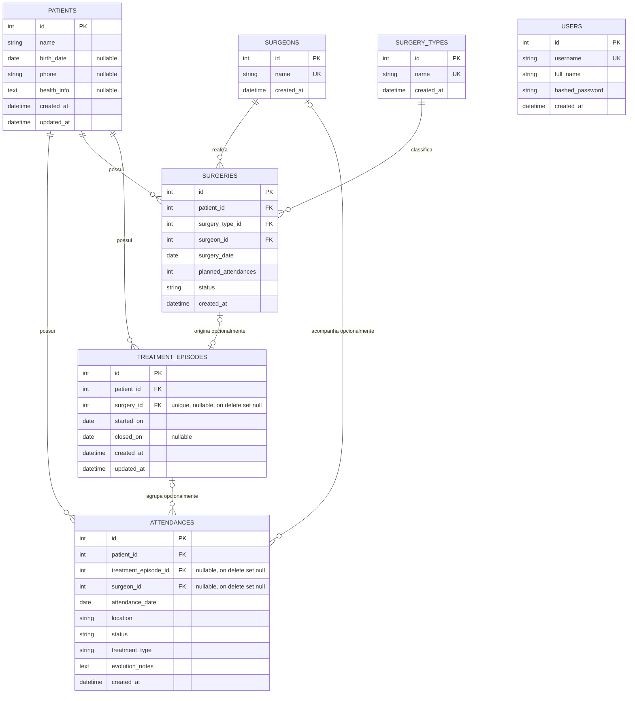

# Diagrama do Banco de Dados

Diagrama baseado nos modelos SQLAlchemy em `app/models`.

## Relacionamentos

- `patients` tem muitos `attendances`, `surgeries` e `treatment_episodes`.
- `surgeries` pertence a um `patient`, um `surgery_type` e um `surgeon`.
- `treatment_episodes` pertence a um `patient` e pode estar vinculado a uma `surgery`.
- `attendances` pertence a um `patient` e pode estar vinculado a um `treatment_episode` e a um `surgeon`.
- `users` controla autenticação e nao se relaciona diretamente com as entidades clinicas.
