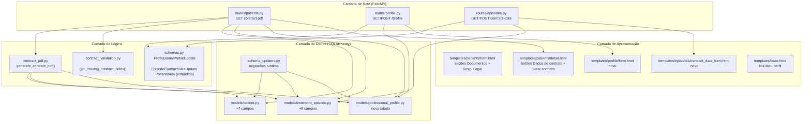
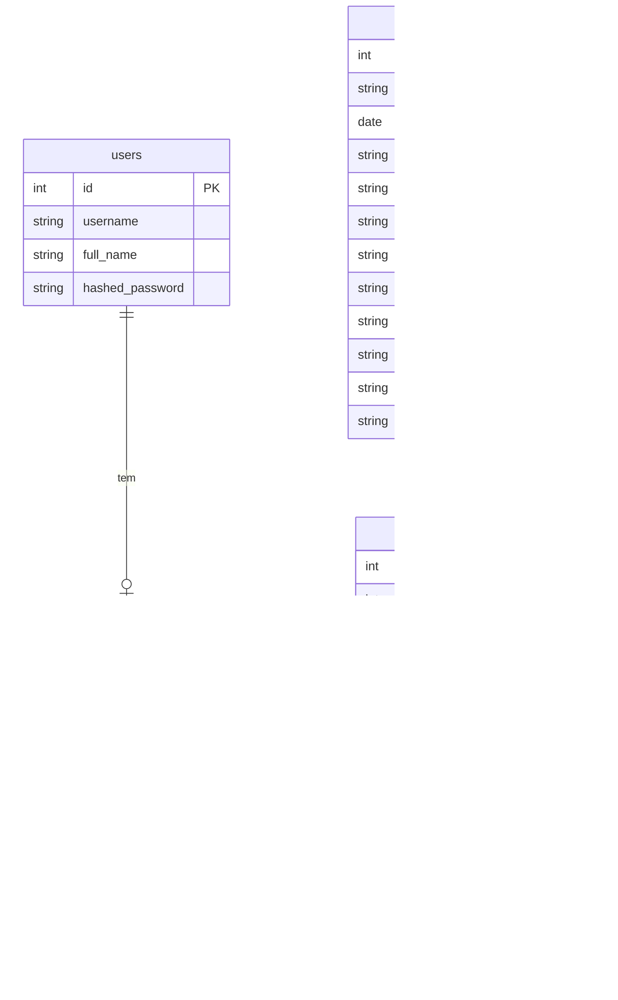

# Design Técnico — Geração de Contratos (contract-generation)

## Overview

Esta funcionalidade adiciona ao FisioGestao a capacidade de gerar contratos de prestação de serviços de fisioterapia em PDF. O contrato é vinculado a um `TreatmentEpisode` e reúne:

- Dados do **paciente** (CONTRATANTE): identificação pessoal, documentos e responsável legal opcional.
- Dados do **fisioterapeuta** (CONTRATADO): informações profissionais e fiscais armazenadas em um novo `ProfessionalProfile`.
- Dados comerciais do episódio: tipo de serviço, valores, forma e condição de pagamento e parcelamento opcional.
- Cláusulas fixas do contrato e seção estática de consentimento de uso de imagem (LGPD).

Todos os campos adicionados por esta funcionalidade permanecem opcionais no banco e nos formulários. Os campos preexistentes preservam integralmente sua nulabilidade e suas regras atuais. Antes de gerar o PDF, uma validação de completude específica do contrato reúne todas as pendências; se houver qualquer campo necessário ausente, nenhum PDF é produzido e a interface apresenta o motivo e a lista completa dos campos que precisam ser preenchidos.

A geração segue o mesmo padrão já adotado para o relatório de evolução clínica: uma rota `GET` no router de pacientes retorna um `StreamingResponse` com o PDF produzido pela biblioteca ReportLab, com toda a lógica de composição isolada em `app/contract_pdf.py`.

### Escopo das mudanças

| Área | Tipo de mudança |
|------|----------------|
| `app/models/patient.py` | +7 campos nullable |
| `app/models/treatment_episode.py` | +8 campos comerciais nullable |
| `app/models/professional_profile.py` | Nova tabela 1:1 com `users` |
| `app/models/__init__.py` | Exportar `ProfessionalProfile` |
| `app/schema_updates.py` | +3 funções de migração runtime |
| `app/schemas.py` | +3 schemas Pydantic, +constantes |
| `app/contract_validation.py` | Validação de completude para geração |
| `app/contract_pdf.py` | Novo módulo gerador de PDF |
| `app/routes/profile.py` | Novo router GET/POST `/profile` |
| `app/routes/episodes.py` | Novo router GET/POST dados comerciais |
| `app/routes/patients.py` | +1 endpoint `contract.pdf` |
| `main.py` | Registrar 2 novos routers |
| Templates | +2 novos, +3 atualizados |

---

## Architecture

A arquitetura segue o padrão MVC-SSR já estabelecido no projeto: rotas FastAPI finas que delegam lógica de domínio para módulos especializados e renderizam templates Jinja2.



---

## Components and Interfaces

### `app/contract_pdf.py`

Módulo central da funcionalidade. Não tem dependências de request/response — recebe objetos ORM e devolve um `BytesIO`.

```python
def generate_contract_pdf(
    patient: Patient,
    episode: TreatmentEpisode,
    professional_profile: ProfessionalProfile | None,
    current_user: User,
) -> BytesIO:
    """
    Compõe e renderiza o PDF do contrato de prestação de serviços.
    Retorna um buffer pronto para StreamingResponse.
    """

def _slug(name: str) -> str:
    """
    Converte nome do paciente para slug de arquivo:
    - unicodedata.normalize para remover acentos
    - minúsculas
    - espaços → underscore
    - remove caracteres que não sejam alnum ou underscore
    """
```

O gerador recebe somente dados que já passaram pela validação de completude. Ele não insere placeholders para campos ausentes e não é chamado quando houver pendências.

### `app/contract_validation.py`

Centraliza a regra de campos necessários para o contrato sem alterar a opcionalidade dos modelos ou schemas de cadastro.

```python
def get_missing_contract_fields(
    patient: Patient,
    episode: TreatmentEpisode,
    professional_profile: ProfessionalProfile | None,
) -> dict[str, list[str]]:
    """
    Retorna apenas grupos com pendências, usando rótulos legíveis para a interface.
    Um dicionário vazio indica que o contrato pode ser gerado.
    """
```

Campos verificados:

- **Paciente:** CPF, RG, endereço e e-mail.
- **Perfil profissional:** CPF/CNPJ, CREFITO, endereço profissional e e-mail profissional.
- **Dados comerciais:** tipo de serviço, procedimento contratado, forma e condição de pagamento.
- **Parcelamento condicional:** quantidade de parcelas e cronograma editável de datas somente quando a condição for “Parcelado”.
- **Valor condicional:** valor da sessão para “Avulso” ou valor do pacote para “Pacote”.
- **Responsável legal:** se o nome estiver preenchido, CPF e vínculo/parentesco.

Valores `None`, strings vazias ou strings compostas somente por espaços são considerados ausentes. A função retorna todos os campos ausentes em uma única execução, sem interromper na primeira pendência.

**Seções do PDF (em ordem):**

1. Cabeçalho com título e metadados da geração
2. Bloco CONTRATADO — dados do `current_user` + `ProfessionalProfile`
3. Bloco CONTRATANTE — dados do `Patient`
4. Bloco RESPONSÁVEL LEGAL — condicional (`legal_guardian_name` não nulo)
5. Cláusula 1 — Objeto (cirurgia/procedimento e plano terapêutico)
6. Cláusula 2 — Sessões e Valores (dados comerciais com checkboxes estáticos)
7. Cláusulas 3–7 — Texto fixo (cancelamento, atrasos, obrigações)
8. Cláusulas 8–16 — Texto fixo (resultados, responsabilidade, LGPD, rescisão)
9. Cláusula 18 — Consentimento de Uso de Imagem — seção estática completa, sempre presente
10. Rodapé com local, data e linhas de assinatura

### `app/routes/profile.py`

```python
router = APIRouter(prefix="/profile", tags=["profile"])

@router.get("")
def get_profile(request, db, current_user):
    # Busca ou instancia ProfessionalProfile do current_user
    # Renderiza templates/profile/form.html

@router.post("")
def update_profile(request, db, current_user, ...Form fields...):
    # Valida ProfessionalProfileUpdate
    # Upsert: se não existe, cria; se existe, atualiza
    # Redireciona GET /profile com 303
```

### `app/routes/episodes.py`

```python
router = APIRouter(tags=["episodes"])

@router.get("/treatment-episodes/{episode_id}/contract-data")
def get_contract_data(request, episode_id, db, current_user):
    # Carrega TreatmentEpisode; verifica existência
    # Renderiza templates/episodes/contract_data_form.html
    # Campos desabilitados se episode.surgery.status == "Alta"

@router.post("/treatment-episodes/{episode_id}/contract-data")
def update_contract_data(request, episode_id, db, current_user, ...Form fields...):
    # Valida EpisodeContractDataUpdate
    # Persiste os 8 campos comerciais no episode
    # Redireciona /patients/{patient_id} com 303
```

### Endpoint de geração do PDF (em `app/routes/patients.py`)

```python
@router.get("/{patient_id}/treatment-episodes/{episode_id}/contract.pdf")
def download_contract_pdf(patient_id, episode_id, db, current_user):
    # 1. Carrega patient via get_patient_or_404
    # 2. Obtém episode via get_episode_for_patient_or_404 (verifica pertencimento)
    # 3. Busca ProfessionalProfile do current_user (pode ser None)
    # 4. Executa get_missing_contract_fields(patient, episode, profile)
    # 5. Se houver pendências, não chama o gerador e renderiza a tela de detalhes
    #    com mensagem e lista de campos ausentes (HTTP 422)
    # 6. Chama generate_contract_pdf(patient, episode, profile, current_user)
    # 7. Monta filename com _slug
    # 8. Retorna StreamingResponse(buffer, media_type="application/pdf")
```

---

## Data Models

### Alterações em `patients`

| Coluna | Tipo | Nulo | Restrição |
|--------|------|------|-----------|
| `cpf` | `VARCHAR(14)` | sim | formato `000.000.000-00`; único entre não-nulos |
| `rg` | `VARCHAR(20)` | sim | — |
| `address` | `VARCHAR(300)` | sim | — |
| `email` | `VARCHAR(120)` | sim | formato com `@` e domínio |
| `legal_guardian_name` | `VARCHAR(140)` | sim | — |
| `legal_guardian_cpf` | `VARCHAR(14)` | sim | formato `000.000.000-00` |
| `legal_guardian_relationship` | `VARCHAR(60)` | sim | — |

Todos os campos são adicionados via `ALTER TABLE ... ADD COLUMN` (nullable, sem `DEFAULT`) — compatível com SQLite sem rebuild.

### Nova tabela `professional_profiles`

| Coluna | Tipo | Nulo | Restrição |
|--------|------|------|-----------|
| `id` | `INTEGER` PK | não | autoincrement |
| `user_id` | `INTEGER` FK → `users.id` | não | `UNIQUE` |
| `cpf_cnpj` | `VARCHAR(14)` | sim | 11 ou 14 dígitos; máscara somente na interface |
| `crefito` | `VARCHAR(30)` | sim | strip; vazio → NULL |
| `professional_address` | `VARCHAR(300)` | sim | — |
| `professional_email` | `VARCHAR(120)` | sim | formato com `@` e domínio |
| `created_at` | `DATETIME` | não | `default=datetime.utcnow` |
| `updated_at` | `DATETIME` | não | `onupdate=datetime.utcnow` |

Relação: `User` 1 ↔ 0..1 `ProfessionalProfile`

### Alterações em `treatment_episodes`

| Coluna | Tipo | Nulo | Opções / Restrição |
|--------|------|------|--------------------|
| `service_type` | `VARCHAR(30)` | sim | "Avulso", "Pacote", "Outro" |
| `contracted_procedure` | `TEXT` | sim | max 1000 chars |
| `session_value` | `NUMERIC(10,2)` | sim | ≥ 0, ≤ 999999.99 |
| `package_value` | `NUMERIC(10,2)` | sim | ≥ 0, ≤ 999999.99 |
| `payment_method` | `VARCHAR(40)` | sim | "Dinheiro", "Pix", "Cartão de débito", "Cartão de crédito", "Transferência bancária", "Outro" |
| `payment_condition` | `VARCHAR(20)` | sim | "À vista", "Parcelado" |
| `installment_count` | `INTEGER` | sim | 2 – 60; usado somente quando parcelado |
| `installment_due_dates` | `TEXT` | sim | array JSON de datas ISO `YYYY-MM-DD`, uma por parcela |

### Diagrama do schema (tabelas novas/alteradas)



---

## Migrações Runtime (`schema_updates.py`)

As três funções abaixo são chamadas por `ensure_runtime_schema(engine)` na inicialização da aplicação.

### `_ensure_patient_contract_fields(engine, dialect)`

Verifica se cada um dos 7 novos campos existe em `patients`. Para campos ausentes, executa `ALTER TABLE patients ADD COLUMN <col> <tipo>`. Como todos são nullable sem `NOT NULL`, o SQLite aceita `ADD COLUMN` diretamente — não é necessário rebuild da tabela.

```python
PATIENT_CONTRACT_COLUMNS = [
    ("cpf",                      "VARCHAR(14)"),
    ("rg",                       "VARCHAR(20)"),
    ("address",                  "VARCHAR(300)"),
    ("email",                    "VARCHAR(120)"),
    ("legal_guardian_name",      "VARCHAR(140)"),
    ("legal_guardian_cpf",       "VARCHAR(14)"),
    ("legal_guardian_relationship", "VARCHAR(60)"),
]
```

### `_ensure_professional_profile_table(engine, dialect)`

Executa `CREATE TABLE IF NOT EXISTS professional_profiles (...)` com todas as colunas. Cria também o índice único em `user_id`.

### `_ensure_episode_contract_fields(engine, dialect)`

Verifica e adiciona os 8 campos comerciais em `treatment_episodes`. Para `session_value` e `package_value` usa o tipo `NUMERIC(10,2)` — compatível com SQLite (que armazena como REAL) e com backends como PostgreSQL.

```python
EPISODE_CONTRACT_COLUMNS = [
    ("service_type",         "VARCHAR(30)"),
    ("contracted_procedure", "TEXT"),
    ("session_value",        "NUMERIC(10,2)"),
    ("package_value",        "NUMERIC(10,2)"),
    ("payment_method",       "VARCHAR(40)"),
    ("payment_condition",    "VARCHAR(20)"),
    ("installment_count",    "INTEGER"),
    ("installment_due_dates", "TEXT"),
]
```

---

## Fluxo de Geração do PDF

```mermaid
sequenceDiagram
    actor Fisio as Fisioterapeuta
    participant Browser
    participant Route as routes/patients.py
    participant Validation as contract_validation.py
    participant PDF as contract_pdf.py
    participant DB as SQLAlchemy / SQLite

    Fisio->>Browser: Clica "Gerar contrato"
    Browser->>Route: GET /patients/{id}/treatment-episodes/{ep_id}/contract.pdf
    Route->>DB: get_patient_or_404(patient_id)
    DB-->>Route: Patient (com episode carregado)
    Route->>DB: get_episode_for_patient_or_404(patient, episode_id)
    DB-->>Route: TreatmentEpisode
    Route->>DB: query ProfessionalProfile WHERE user_id = current_user.id
    DB-->>Route: ProfessionalProfile | None
    Route->>Validation: get_missing_contract_fields(patient, episode, profile)
    alt existem campos ausentes
        Validation-->>Route: pendências agrupadas
        Route-->>Browser: HTML 422 com motivo e lista completa
        Browser-->>Fisio: Exibe campos que precisam ser preenchidos
    else dados completos
        Validation-->>Route: dicionário vazio
    Route->>PDF: generate_contract_pdf(patient, episode, profile, user)
    PDF->>PDF: Compor seções (CONTRATADO, CONTRATANTE, cláusulas...)
    PDF->>PDF: Sempre adicionar seção de consentimento de imagem
    PDF-->>Route: BytesIO buffer
    Route-->>Browser: StreamingResponse (application/pdf)\nContent-Disposition: attachment; filename="contrato_..."
    Browser-->>Fisio: Download do PDF iniciado
    end
```

---

## Schemas Pydantic (`schemas.py`)

### Novas constantes

```python
SERVICE_TYPE_OPTIONS = ["Avulso", "Pacote", "Outro"]
PAYMENT_METHOD_OPTIONS = [
    "Dinheiro", "Pix", "Cartão de débito",
    "Cartão de crédito", "Transferência bancária", "Outro"
]
```

### Extensão de `PatientBase`

Adicionar campos opcionais com validadores:

```python
cpf: str | None = Field(default=None, max_length=14)
rg: str | None = Field(default=None, max_length=20)
address: str | None = Field(default=None, max_length=300)
email: str | None = Field(default=None, max_length=120)
legal_guardian_name: str | None = Field(default=None, max_length=140)
legal_guardian_cpf: str | None = Field(default=None, max_length=14)
legal_guardian_relationship: str | None = Field(default=None, max_length=60)
```

Validadores adicionados:
- `cpf` e `legal_guardian_cpf`: regex `^\d{3}\.\d{3}\.\d{3}-\d{2}$` quando não-nulo/não-vazio
- `email`: deve conter `@` com pelo menos um `.` após, quando não-nulo/não-vazio

### `ProfessionalProfileUpdate`

```python
class ProfessionalProfileUpdate(BaseModel):
    cpf_cnpj: str | None = Field(default=None, max_length=18)  # aceita entrada mascarada
    crefito: str | None = Field(default=None, max_length=30)
    professional_address: str | None = Field(default=None, max_length=300)
    professional_email: str | None = Field(default=None, max_length=120)
    # Validators:
    # - cpf_cnpj: aceita CPF/CNPJ com ou sem máscara, valida 11/14 dígitos e retorna somente números
    # - professional_email: contém @ e ponto após @ quando preenchido
    # - crefito: strip; "" → None
```

### `EpisodeContractDataUpdate`

```python
class EpisodeContractDataUpdate(BaseModel):
    service_type: str | None = Field(default=None, max_length=30)
    contracted_procedure: str | None = Field(default=None, max_length=1000)
    session_value: Decimal | None = Field(default=None, ge=Decimal("0"), le=Decimal("999999.99"))
    package_value: Decimal | None = Field(default=None, ge=Decimal("0"), le=Decimal("999999.99"))
    payment_method: str | None = Field(default=None, max_length=40)
    payment_condition: str | None = Field(default=None, max_length=20)
    installment_count: int | None = Field(default=None, ge=2, le=60)
    installment_due_dates: list[date] | None = Field(default=None, max_length=60)
    # Validators:
    # - service_type: em SERVICE_TYPE_OPTIONS quando preenchido
    # - payment_method: em PAYMENT_METHOD_OPTIONS quando preenchido
    # - payment_condition: em PAYMENT_CONDITION_OPTIONS quando preenchido
```

---

## Correctness Properties

*Uma propriedade é uma característica ou comportamento que deve se manter verdadeiro em todas as execuções válidas de um sistema — essencialmente, um enunciado formal sobre o que o sistema deve fazer. As propriedades servem como ponte entre especificações legíveis por humanos e garantias de correção verificáveis por máquinas.*

### Property 1: Validação de formato de CPF/CNPJ

*Para qualquer* string de CPF do paciente ou responsável que não corresponda ao formato `000.000.000-00`, o schema deve rejeitar a validação. Para `cpf_cnpj`, qualquer entrada que não represente exatamente 11 ou 14 dígitos, com ou sem a máscara brasileira correspondente, deve ser rejeitada; entradas válidas devem resultar somente nos dígitos para persistência.

**Validates: Requirements 1.5, 2.4, 3.3**

### Property 2: Validação de formato de e-mail

*Para qualquer* string que não contenha exatamente um caractere `@` seguido de pelo menos um `.` com pelo menos um caractere após ele, quando fornecida como `email` ou `professional_email`, o schema Pydantic correspondente deve rejeitar a validação com erro.

**Validates: Requirements 1.6, 3.4**

### Property 3: Unicidade de CPF do paciente

*Para qualquer* par de pacientes distintos já persistidos, se ambos possuírem `cpf` não-nulo, esses CPFs devem ser diferentes — a tentativa de persistir um segundo paciente com CPF já existente deve ser rejeitada pela camada de rota com mensagem de erro.

**Validates: Requirements 1.7**

### Property 4: Round-trip de persistência dos dados cadastrais

*Para qualquer* combinação válida de campos de `Patient`, `ProfessionalProfile` e dados comerciais de `TreatmentEpisode` (incluindo campos nulos), salvar e depois recuperar do banco deve retornar exatamente os mesmos valores fornecidos, sem modificação, truncamento ou conversão silenciosa.

**Validates: Requirements 1.8, 3.1, 3.6, 4.1, 6.13, 7.2**

### Property 5: Unicidade do perfil profissional por usuário (idempotência do upsert)

*Para qualquer* usuário autenticado, executar o `POST /profile` duas vezes com dados diferentes deve resultar em exatamente um registro em `professional_profiles` com os valores da segunda submissão — nunca dois registros para o mesmo `user_id`.

**Validates: Requirements 3.2**

### Property 6: Normalização de campos de texto com apenas espaços

*Para qualquer* string composta inteiramente por espaços em branco fornecida ao campo `crefito`, o valor persistido no banco deve ser `None` ou string vazia — nunca uma string de espaços.

**Validates: Requirements 3.7**

### Property 7: Rejeição de valores de domínio inválidos

*Para qualquer* valor de `service_type`, `payment_method` ou `payment_condition` fora de suas opções, `installment_count` fora de [2, 60], data de parcela inválida, ou valor monetário fora do intervalo permitido, o schema `EpisodeContractDataUpdate` deve rejeitar com erro e nenhum dado deve ser persistido. Na geração, o número de datas válidas deve ser igual à quantidade de parcelas quando `payment_condition == "Parcelado"`.

**Validates: Requirements 4.2, 4.7, 4.8, 4.9, 7.6, 7.7**

### Property 8: Completude das seções obrigatórias do PDF

*Para qualquer* conjunto de paciente, perfil profissional e episódio que satisfaça a validação de completude, o PDF gerado por `generate_contract_pdf` deve conter todas as seções obrigatórias: identificação das partes (CONTRATADO e CONTRATANTE), objeto do contrato, condições comerciais e a seção de autorização de uso de imagem com os checkboxes para preenchimento manual.

**Validates: Requirements 5.1, 5.3, 6.5, 6.7, 6.12**

### Property 9: Slug do nome do paciente no nome do arquivo

*Para qualquer* nome de paciente (incluindo acentos, cedilhas, espaços múltiplos e caracteres especiais), a função `_slug` deve produzir uma string que contenha apenas caracteres alfanuméricos ASCII minúsculos e underscores — nunca espaços, acentos ou caracteres especiais.

**Validates: Requirements 6.3**

### Property 10: Inclusão condicional do bloco de responsável legal

*Para qualquer* conjunto de dados completo em que `legal_guardian_name` seja não-nulo e não-vazio, o PDF gerado deve conter nome, CPF e vínculo do responsável legal no bloco do CONTRATANTE. *Para qualquer* conjunto completo em que `legal_guardian_name` seja nulo ou vazio, o bloco de responsável legal não deve aparecer no PDF.

**Validates: Requirements 6.6**

### Property 11: Bloqueio da geração com lista completa de pendências

*Para qualquer* combinação de dados em que pelo menos um campo necessário para o contrato seja `None`, vazio ou composto apenas por espaços, `get_missing_contract_fields` deve retornar o rótulo de cada campo ausente no grupo correto e o endpoint não deve chamar `generate_contract_pdf`. Se não houver pendências, a função deve retornar um dicionário vazio e permitir a geração.

**Validates: Requirements 4.5, 4.6, 6.8, 6.12, 6.13**

### Property 12: Isolamento de episódios por paciente

*Para qualquer* requisição `GET /patients/{patient_id}/treatment-episodes/{episode_id}/contract.pdf` onde `episode_id` pertence a um paciente diferente de `patient_id`, o sistema deve retornar HTTP 404 sem gerar nenhum arquivo PDF.

**Validates: Requirements 6.10**

---

## Error Handling

### Erros de validação de formulário

Seguindo o padrão já estabelecido no projeto:
- A rota captura `ValidationError` do Pydantic
- Chama `validation_messages(exc, field_labels)` para produzir mensagens em português
- Re-renderiza o template com `errors=` e `status_code=422`
- Os dados do formulário são preservados via `form_data=` para que o usuário não precise redigitar

Exemplos de mensagens de erro:
- CPF inválido: `"CPF deve estar no formato 000.000.000-00."`
- E-mail inválido: `"E-mail deve conter @ seguido de domínio válido."`
- Valor negativo: `"Valor da sessão deve ser maior ou igual a 0."`
- Método de pagamento inválido: `"Forma de pagamento inválida."`

### Erros de unicidade (CPF duplicado)

A verificação de CPF único é feita na camada de rota (não no schema, pois requer acesso ao banco):

```python
if data.cpf:
    existing = db.query(Patient).filter(
        Patient.cpf == data.cpf,
        Patient.id != patient_id  # excluir o próprio paciente na edição
    ).first()
    if existing:
        errors.append("CPF já cadastrado para outro paciente.")
        return TemplateResponse(422)
```

### Erros na geração do PDF

```python
try:
    buffer = generate_contract_pdf(patient, episode, profile, current_user)
except Exception as exc:
    logger.error("Falha ao gerar contrato para episode_id=%d: %s", episode_id, exc)
    raise HTTPException(status_code=500, detail="Falha na geração do contrato. Tente novamente.")
```

### Dados ausentes para geração

A ausência de dados necessários é uma falha de pré-condição conhecida, não um erro interno. Após carregar e autorizar os recursos, a rota executa a validação antes de chamar o ReportLab:

```python
missing_fields = get_missing_contract_fields(patient, episode, profile)
if missing_fields:
    return templates.TemplateResponse(
        request=request,
        name="patients/detail.html",
        context={
            # mesmo contexto normalmente usado pela tela de detalhes
            "patient": patient,
            "contract_error": "Não foi possível gerar o contrato. Preencha os campos obrigatórios para o contrato:",
            "contract_missing_fields": missing_fields,
            "contract_episode_id": episode.id,
        },
        status_code=422,
    )
```

O template exibe todas as pendências agrupadas e mantém os botões/links para que o usuário possa acessar o cadastro do paciente, o perfil profissional e os dados comerciais. `generate_contract_pdf` não é invocado nesse fluxo e nenhum arquivo parcial é criado.

### Dependência ReportLab ausente

Seguindo o padrão do endpoint de evolução clínica:

```python
try:
    from reportlab.lib.pagesizes import A4
    # ...
except ModuleNotFoundError as exc:
    raise HTTPException(status_code=500, detail="Dependência ausente para gerar PDF. Instale reportlab.")
```

### Dados comerciais incompletos

Quando `service_type == "Avulso"` e `session_value is None` (ou `"Pacote"` e `package_value is None`), o cadastro do episódio continua podendo ser salvo normalmente, pois os campos permanecem opcionais. Ao tentar gerar o contrato, entretanto, a validação inclui “Valor da sessão” ou “Valor do pacote” na lista de pendências e bloqueia a geração.

---

## Testing Strategy

### Abordagem dual: testes unitários + testes baseados em propriedades

Os testes são organizados em dois grupos complementares:

**Testes unitários (exemplos e casos específicos)**:
- Comportamentos de formulário específicos (campos desabilitados com status "Alta", aviso de CPF ausente do responsável legal)
- Integração entre rotas e templates (presença de botões e campos no HTML)
- Cenários de erro de infraestrutura (mock do banco para simular falhas)
- Casos-limite não cobertos pelos geradores de propriedades

**Testes baseados em propriedades** (biblioteca recomendada: [Hypothesis](https://hypothesis.readthedocs.io/)):
- Cada propriedade listada na seção anterior é implementada como um único teste com `@given`
- Mínimo de 100 iterações por propriedade (padrão do Hypothesis)
- As propriedades de geração de PDF testam `generate_contract_pdf` e `_slug` diretamente com dados completos, sem dependência de banco
- A propriedade de bloqueio testa `get_missing_contract_fields` diretamente e confirma, no endpoint, que o gerador não é chamado quando existem pendências
- As propriedades de validação de schema testam os schemas Pydantic diretamente, sem necessidade de inicializar o FastAPI

**Estrutura dos testes de propriedade:**

```python
# Feature: contract-generation, Property 1: Validação de formato CPF/CNPJ
@given(cpf=st.text().filter(lambda s: not re.match(r'^\d{3}\.\d{3}\.\d{3}-\d{2}$', s) and s != ""))
def test_cpf_format_rejection(cpf):
    with pytest.raises(ValidationError):
        PatientCreate(name="Teste", cpf=cpf)

# Feature: contract-generation, Property 9: Slug do nome do paciente
@given(name=st.text(min_size=1))
def test_slug_contains_only_safe_chars(name):
    result = _slug(name)
    assert re.match(r'^[a-z0-9_]*$', result)
```

**Tag de cada teste:**

```python
# Feature: contract-generation, Property {número}: {texto da propriedade}
```

### Testes de integração

Para os comportamentos que dependem de banco de dados (unicidade de CPF, upsert de perfil, episódio pertencente ao paciente), usar banco SQLite em memória com fixtures pytest:

```python
@pytest.fixture
def db():
    engine = create_engine("sqlite:///:memory:")
    Base.metadata.create_all(engine)
    with Session(engine) as session:
        yield session
```

### O que não é testado automaticamente

- Requisitos de performance (10s / 30s para geração do PDF) — verificados manualmente ou por testes de carga separados
- Aparência visual do PDF — verificado por inspeção manual do arquivo gerado
- Feedback visual de campos desabilitados (`disabled` em HTML) — verificado por testes de browser (Playwright/Selenium) fora do escopo desta sprint
